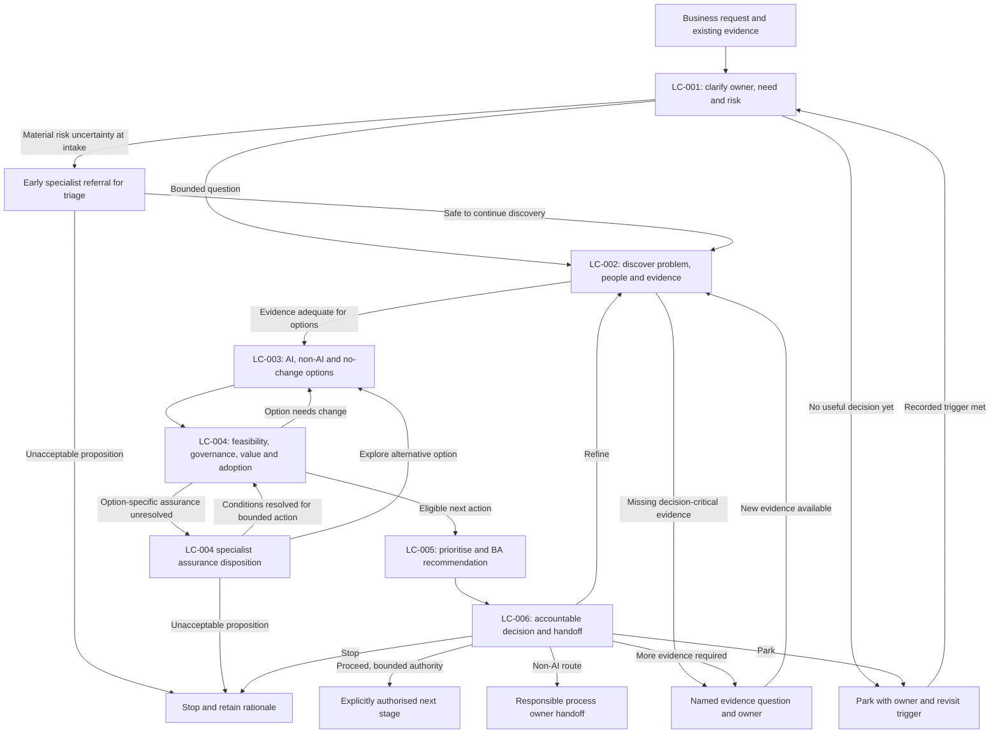

# TO-BE Business Process

Status: DRAFT
Owner: Namit Singh
Phase: 2
Basis: OPPORTUNITY_LIFECYCLE.md (LC-001..006), BA_OPERATING_MODEL.md, RACI.md; baseline fb5f23f / 3cdbcce.

## Narrative

A requestor brings a need or proposed solution. The BA clarifies the decision and ownership and screens for risk immediately. Discovery combines process, people and evidence; stakeholder engagement and assurance recur when new facts emerge. The BA compares AI, rules/process, existing-tool and no-change options. Technical, governance, finance and operational owners assess their respective domains in parallel. Eligible next actions are prioritised transparently. The BA recommends; accountable authorities decide and name the receiving/change/measurement owner.

SCN-001 tests missing measurement and category ambiguity; SCN-002 tests an early non-AI direction; SCN-003 tests governance escalation already present at intake; SCN-004 tests a proportionate early pause. The process does not require every request to traverse all stages.

## Business process diagram

This diagram is business flow, not software architecture. The two governance touchpoints are distinct. Early specialist referral at triage (G1) handles material risk uncertainty at intake; it returns to discovery (LC-002) when it is safe to continue, or stops the proposition — it does not jump straight to LC-004 assurance and never bypasses problem understanding and options. Option-specific assurance at LC-004 (G2) is resolved against a specific option; it may return that option to LC-004 once conditions are met, send it back to options (LC-003) to explore a safer alternative, or stop it. STOP can also be recorded at triage/discovery/options by the relevant authority when continued analysis is unjustified. An affected processing activity may be held while safe desk analysis and alternative-option exploration continue. A governance disposition never substitutes for technical or spending authority.

## Information, evidence and decision flow

| Gate | Information carried forward | Authority and outcome evidence |
|---|---|---|
| LC-001 | Original request, owner, intended use, risk flags, existing references | Sponsor capacity decision and specialist referral where needed; triage rationale |
| LC-002 | Problem, stakeholder perspectives, current process, evidence/gaps and competing causes | Business-context confirmation and BA evidence-quality judgement; no invented stakeholder approval |
| LC-003 | Option comparisons including process/rules and no change | BA shortlist rationale; engineering/business/user objections retained |
| LC-004 | Feasibility, data readiness, specialist conditions, value range, adoption/change and measurement plan | Separate STK-04/05/06/01 dispositions; unresolved hard gates block affected next action |
| LC-005 | Eligible options, confidence, capacity, trade-offs and dependencies | BA recommendation and sponsor prioritisation rationale; no automatic score approval |
| LC-006 | Decision pack, dissent, conditions and receiving owner | Accountable disposition, scope, reviewer/date, receiving-owner acknowledgement and revisit trigger |

## Value and adoption before handoff

Record baseline definition and period, prospective benefit, potential harm, all material cost categories and measurement owner before proposing progression. Plan later checks for solution performance where relevant, actual use, operational outcome, strategic contribution and financial realisation. Rates need denominators; savings need a credible cash/capacity distinction. No pilot is run in Phase 2. If real measurement is inaccessible, recommend obtaining it rather than filling in invented results.

The operational owner plans training, exception handling and reinforcement; end users challenge extra work; delivery receives assumptions and dependencies. Later results should return to the opportunity decision record and may trigger scale/iterate/stop, but those later stages are outside this phase's execution.

## Traceability and change

Keep one chain of references from request/SCN to PP/ASM/RSK, evidence/source, options, authority dispositions, recommendation and decision. Do not allocate requirements or story identifiers now. Changed purpose, data, decision effect, cost or ownership reopens the relevant gate; a previously approved record is not blanket clearance for changed scope. Keep superseded decisions and reasons.
